# System Architecture Diagrams

## 1. Component Architecture


## 2. Data Flow Architecture


## 3. Screen Navigation Flow

```mermaid
graph LR
    subgraph "Bottom Tab Navigator"
        DASH[🏠 Dashboard]
        WAY[📍 Waypoints]
        FOL[👣 Follow]
        VOI[🎙 Voice]
        SET[⚙️ Settings]
    end
    
    DASH --> QUICK[Quick Actions]
    QUICK --> WAY
    QUICK --> FOL
    
    WAY --> MAP[Map View]
    WAY --> LIST[Waypoint List]
    WAY --> CTRL[Patrol Controls]
    
    FOL --> TOGGLE[Follow Toggle]
    FOL --> DIST[Distance Slider]
    FOL --> STATUS[Status Display]
    
    VOI --> MIC[Mic Button]
    VOI --> STT[STT Processing]
    VOI --> CMD[Command Execution]
    
    SET --> ROBOTS[Robot List]
    SET --> PAIR[Pairing Guide]
    SET --> FW[Firmware Update]
    SET --> INFO[App Info]
    
    style DASH fill:#ffebee
    style WAY fill:#e3f2fd
    style FOL fill:#f3e5f5
    style VOI fill:#e8f5e9
    style SET fill:#fff3e0
```



## 4. ROS Topic Architecture

```mermaid
graph TB
    subgraph "Subscribe Topics"
        BAT[/battery_state<br/>Battery Info]
        POS[/amcl_pose<br/>Robot Position]
        CAM[/camera/color/thumbnail<br/>Camera Feed]
        FSTAT[/follow_status<br/>Follow State]
        ODOM[/odom<br/>Odometry]
        SCAN[/scan<br/>LiDAR Data]
    end
    
    subgraph "Publish Topics"
        VEL[/cmd_vel<br/>Movement Commands]
        ESTOP[/emergency_stop<br/>Emergency Stop]
        FDIST[/follow_distance<br/>Follow Settings]
    end
    
    subgraph "Services"
        SFOL[/start_follow<br/>Start Following]
        STFOL[/stop_follow<br/>Stop Following]
        SERVO[/set_servo_state<br/>Servo Control]
        INFO[/get_robot_info<br/>Robot Info]
    end
    
    subgraph "Actions"
        WAYP[/follow_waypoints<br/>Waypoint Navigation]
        NAVP[/navigate_to_pose<br/>Single Pose Navigation]
    end
    
    APP[Mobile App]
    
    BAT --> APP
    POS --> APP
    CAM --> APP
    FSTAT --> APP
    ODOM --> APP
    SCAN --> APP
    
    APP --> VEL
    APP --> ESTOP
    APP --> FDIST
    
    APP -.->|call| SFOL
    APP -.->|call| STFOL
    APP -.->|call| SERVO
    APP -.->|call| INFO
    
    APP ==>|goal| WAYP
    APP ==>|goal| NAVP
    
    style APP fill:#fafafa
```

## 5. State Management Flow

```mermaid
stateDiagram-v2
    [*] --> Disconnected
    
    Disconnected --> Connecting: User initiates connection
    Connecting --> Connected: WebSocket established
    Connecting --> Error: Connection failed
    Error --> Connecting: Retry
    Connected --> Disconnected: Connection lost
    
    state Connected {
        [*] --> Idle
        
        state Idle {
            [*] --> Monitoring
            Monitoring --> Monitoring: Update battery/position
        }
        
        Idle --> Navigating: Start patrol
        Navigating --> Idle: Stop/Complete
        
        Idle --> Following: Start follow
        Following --> Idle: Stop follow
        
        Idle --> VoiceListening: Mic pressed
        VoiceListening --> Processing: Release mic
        Processing --> Idle: Command executed
    }
    
    Connected --> EmergencyStop: E-Stop pressed
    EmergencyStop --> Idle: Reset
```



## 6. Component Hierarchy


## 7. Voice Command Processing

```mermaid
graph LR
    MIC[Microphone<br/>Input] --> AUDIO[Audio<br/>Capture]
    AUDIO --> STT[STT Engine<br/>Vosk/Whisper]
    STT --> TEXT[Text<br/>Output]
    TEXT --> PARSER[Command<br/>Parser]
    
    PARSER --> CMD1[순찰 시작]
    PARSER --> CMD2[따라와]
    PARSER --> CMD3[정지]
    PARSER --> CMD4[로봇 찾기]
    
    CMD1 --> ACT1[Start Patrol<br/>Action]
    CMD2 --> ACT2[Start Follow<br/>Service]
    CMD3 --> ACT3[Emergency Stop<br/>Topic]
    CMD4 --> ACT4[Find Robot<br/>Service]
    
    ACT1 --> ROS[ROS<br/>Commands]
    ACT2 --> ROS
    ACT3 --> ROS
    ACT4 --> ROS
    
    style MIC fill:#e8f5e9
    style STT fill:#c8e6c9
    style PARSER fill:#a5d6a7
    style ROS fill:#81c784
```



## 8. Deployment Architecture


---

These diagrams provide visual representations of the Watchdot App architecture, showing component relationships, data flows, and system interactions.